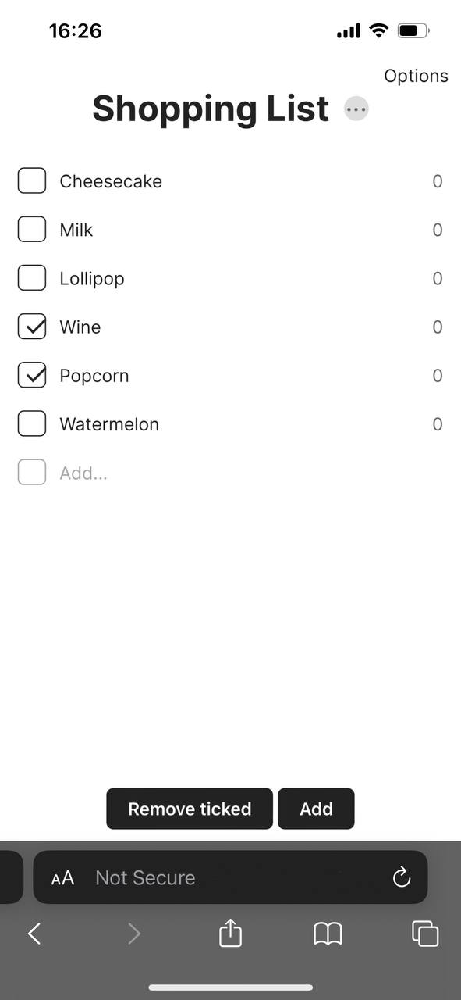

# Shoppling List App

Simple free shopping list web application without registration

## Test, use

Download files, upload them to your server and follow _index.html_

## Features

### Quick start
Make lists right out of the box — the first time the application is launched, it immediately creates the first empty list

### Items
Add items to the list, mark the purchased ones

### Price recognition
Enter the price of the product when adding a list item and it will be displayed on the right

<table>
  <tr>
    <td></td>
    <td></td>
  </tr>
</table>

### Multiple lists
You can create as many lists as you want for different purposes

### List clearing
You can clean up your list by deleting all the items marked with a tick. You will have the opportunity to restore these items before the page is reloaded

### No registration
All your lists are saved in cookies or in your browser's local storage

### Safety
Your shopping lists are not saved anywhere except on your device  
**Where is your data stored?**  
|Condition                   |Storage|
|----------------------------|-------|
|One list, less than 10 items|Cookies|
|One list, 10 items or more  |Local Storage|
|Multiple lists              |Local Storage|

## Technology stack
* HTML, CSS
* JavaScript
* Flex boxes
* Cookie storage
* Local storage